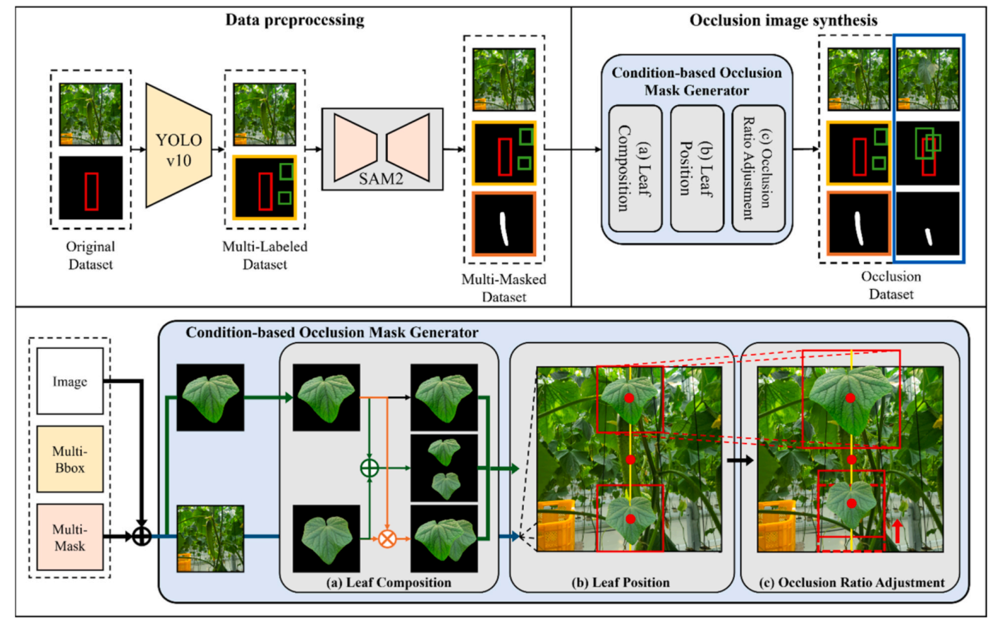

# Condition-based Synthetic Dataset for Amodal Segmentation of Occluded Cucumbers in Agricultural Images

#### Computers and Electronics in Agriculture 2025 [📄 Paper](https://www.sciencedirect.com/science/article/pii/S0168169925009068) · [📑 BibTeX](assets/cucumber_bibTex.bib)

<a href="https://scholar.google.co.kr/citations?user=i4nJgtEAAAAJ&hl=ko&oi=sra">Jin-Ho Son</a><sup>1</sup>*,
<a href="https://hojunking.github.io/webpages/hojunsong/">Hojun Song</a><sup>2</sup>,
<a href="https://scholar.google.co.kr/citations?user=m-NwAdUAAAAJ&hl=ko&oi=sra">Chae-yeong Song</a><sup>2</sup>,
<a href="https://scholar.google.co.kr/citations?user=QzuLLbcAAAAJ&hl=ko&oi=sra">Minse Ha</a><sup>2</sup>,
<a href="https://scholar.google.com/citations?user=mN32nwQAAAAJ&hl=ko">Dabin Kang</a><sup>2</sup>,
and <a href="https://scholar.google.co.kr/citations?user=n5RWOaMAAAAJ&hl=ko&oi=sra">Yu-Shin Ha</a><sup>1,3†</sup>

\* Equal contribution  
† Corresponding author  

<sup>1</sup>Department of Bio-Industrial Mechanical Engineering, Kyungpook National University (KNU)  
<sup>2</sup>School of Computer Science and Engineering, Kyungpook National University (KNU)  
<sup>3</sup>Upland Field Machinery Research Center, Kyungpook National University (KNU)

<p align="center">
  
</p>

This repository presents a **condition-based synthetic dataset generation framework** for **amodal instance segmentation of occluded cucumbers** in agricultural images.  
The framework systematically synthesizes realistic occlusion scenarios by controlling **leaf composition, spatial positioning, and occlusion ratios**, while also incorporating **gamma-based brightness and contrast augmentation** to simulate diverse real-world illumination conditions.

The resulting dataset enables robust training of amodal segmentation models, improving their ability to infer complete object shapes under **severe occlusion and dynamic lighting**, which are common challenges in precision agriculture environments.

## TODO
- [x] README Update
- [x] Raw Code Release
- [ ] Specific Code Release

## Quickstart (Added)

### 1) Install

```bash
pip install -r requirements.txt
```

### 2) Prepare data layout

```
data/
  splitted/
    images/{train,valid,debugging}
    masks/{train,valid,debugging}
    cropped_leaves/{train,valid,debugging}
```

Notes:
- Cucumber masks are selected by filename containing `_0_`.
- Leaf crops are expected to be RGBA with alpha channel.

### 3) Run (CLI)

```bash
python modal_mask_generation.py \
  --data_root C:\path\to\data \
  --out_root C:\path\to\outputs \
  --dataset_type debugging \
  --sample_limit 5 \
  --position random \
  --multi_leaves 0 \
  --random_ratio true
```

### 4) Run (Scripts)

```bash
bash scripts/run_generation.sh ./data ./outputs debugging random 0 true 5
```

```powershell
.\scripts\run_generation.ps1 -DataRoot .\data -OutRoot .\outputs -DatasetType debugging -Position random -MultiLeaves 0 -RandomRatio $true -SampleLimit 5
```

### Output structure

```
outputs/
  amodal_images/
  modal_masks/
  amodal_info/
    dataset.json
```

## CLI Options

- `--seed`: set RNG seed for reproducibility
- `--dry_run true`: validate paths and exit without generating data
- `--log_level DEBUG|INFO|WARNING|ERROR`: control console verbosity
- `--target_size WIDTH,HEIGHT`: override output size (default `768,1024`)

## Citation

If you find this work useful, please cite:
```
@article{SON2025110800,
title = {Condition-based synthetic dataset for amodal segmentation of occluded cucumbers in agricultural images},
journal = {Computers and Electronics in Agriculture},
volume = {238},
pages = {110800},
year = {2025},
issn = {0168-1699},
doi = {https://doi.org/10.1016/j.compag.2025.110800},
url = {https://www.sciencedirect.com/science/article/pii/S0168169925009068},
author = {Jin-Ho Son and Hojun Song and Chae-yeong Song and Minse Ha and Dabin Kang and Yu-Shin Ha},
keywords = {Amodal segmentation, Computer vision, Occlusion, Precision agriculture, Synthetic dataset generation},
abstract = {Occlusion, caused by overlapping leaves and dense foliage, poses significant challenges for crop segmentation in agricultural environments. Traditional segmentation methods struggle to handle these occlusions, particularly in complex and dynamic agricultural settings. As agricultural environments are subject to varying lighting conditions and environmental factors, the ability to detect and segment crops accurately remains a persistent issue in precision farming. This study aims to address these challenges through the development of a Synthetic Dataset Generation Framework that replicates realistic occlusion scenarios using a condition-based approach. Systematic adjustments to leaf composition, position, and occlusion ratios facilitated the framework to generate synthetic datasets representative of the diverse and complex conditions found in agricultural environments. To enhance realism, gamma correction-basedbrightness and contrast augmentations were applied to simulate both low-light and high-light conditions. These augmentations enhanced dataset diversity to better replicate real-world illumination variations. The ability of the model to handle dynamic lighting and complex occlusion scenarios was enhanced through this approach, advancing precision agriculture and contributing to sustainable farming practices by providing more reliable, adaptable segmentation solutions for real-world agricultural applications.}
}
```

## Acknowledgement

This work was supported by the National Research Foundation of Korea (NRF) under the BK21 FOUR program.  
This research was also conducted as part of the <a href="https://www.knu.ac.kr/wbbs/wbbs/bbs/btin/viewBtin.action?bbs_cde=1&btin.bbs_cde=1&btin.doc_no=1331701&btin.appl_no=000000&menu_idx=67">**2024 BK21 Graduate Student Interdisciplinary Community Project** (융복합공동체 프로젝트)</a>, under the team **“Deep Learning-based Automatic Cucumber Harvesting Robot Research”**, led by <a href="https://hojunking.github.io/webpages/hojunsong/">**Hojun Song**</a>.

Our work builds on and utilizes the following tools and models:
- [YOLOv10](https://github.com/THU-MIG/yolov10)
- [Segment Anything Model (SAM v2)](https://github.com/facebookresearch/sam2)
- [AISFormer](https://github.com/UARK-AICV/AISFormer)

